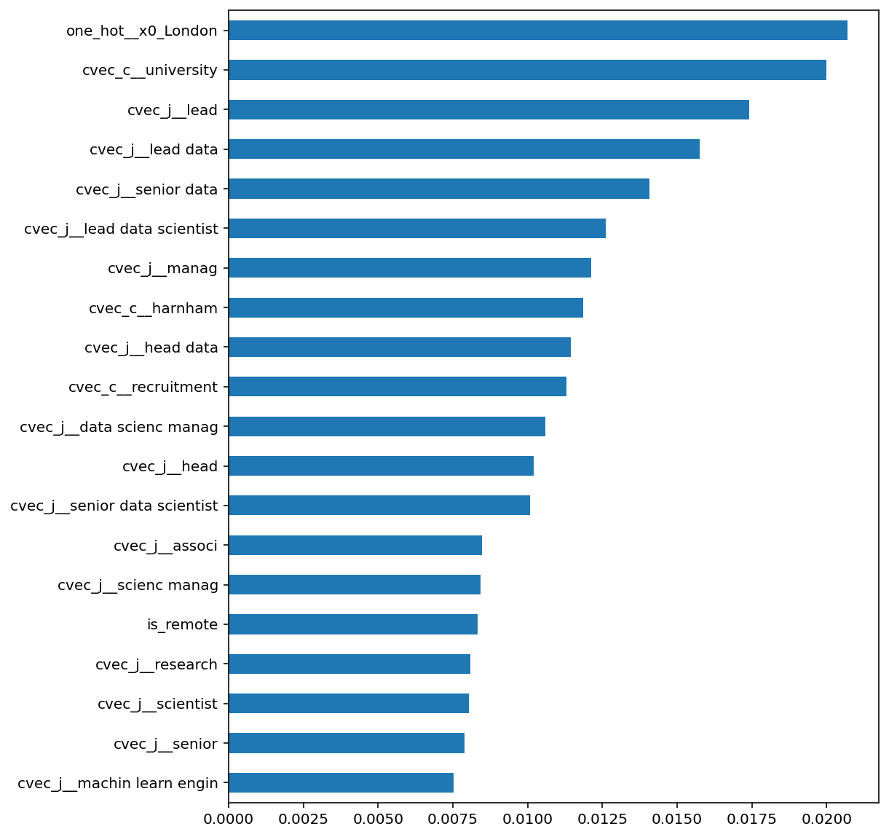
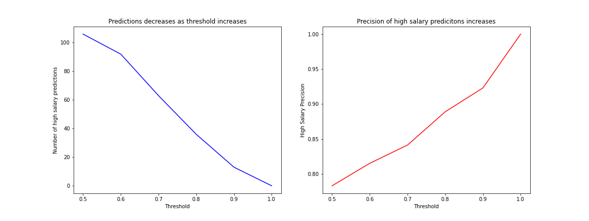

## Predicting high salaries from Indeed.com posting
---

**Overview**

Using information taken from [uk.indeed.com](https://uk.indeed.com) I built a predictive model to identify job postings likely to offer high salaries. Steps taken to do this were:
1. Webscraping information from the website and data cleaning
2. Use of count vectorizer for text based fields
3. Random Forest Classifier

Considering the feature importances: the key features of a job posting likely to influence whether or not it is high salary are:

- whether the job is based in London
- whether the job title is either for a lead or senior data role
- whether the employing organisation has University in its name

The criterion for a high salary was set as greater than the median which, for the data collected was £60,000.

---
*Webscraping*

For this exercise, I was interested in jobs matching the desciption of 'Data Scientist' offering greater than £20,000. Search results for Indeed.com provide 15 results at a time. Using the template URL "https://uk.indeed.com/jobs?q=data+scientist+%C2%A320,000&l={city}&start={page_number}" I looped through all available pages for 16 different cities were looped through. For most cities, there were only a page or two worth of results so working out the maximum page number for each city prior to looping saved a lot of time. Thankfully Indeed.com note the number of job matches on page 1 from which the max page count was calcualated. There is a maximum of 65 pages of results per search, though this was relevant only for London.

The information gathered included job title, company name, location, as well as the salary information to be used to create a binary variable as the predictor variable, with 1 representing high salaries (those above £60,000) and 0 otherwise. All available results for the selected cities were scraped on 5th September and 7th September. This provided 330 unique job results with salary information from which to build and test the model.

Information from Indeed.com isn't necessarily consistent, with some locations being provided as a city, some as a region, and others included post codes. Information on whether the job offers remote working was also included in the location information. Binary variables were created to capture whether remote working (and temporarily remote working) was specified in the job location to be used as a feature variable. The location variable was cleaned to to provide consistent groupings of locations. For locations with fewer than 5 observatiaons, these were put into a final grouping. This condensed the variable to 10 locations from which dummy variables were created.

Rather than attempt to group job titles or companies, I used used count vectorizer to transform the columns. Prior to this I removed symbols and stop words before passing the jobs data through a stemmer. The count vextorizer was set to consider up to groups of three words to ensure combinations such as 'Senior Data Scientist' were captured.

 *The Model*

A pipeline to transform the relevant varaious, standardize the data and instantiate the model was instantiated, with a few different classifiers tried. Logistic regression, random forest and gradient boosting were the three techniques used with 5 k cross-validation.

Random Forest seemed to perform best on cross-validation of the training set with an average accuracy score of 0.75 from cross-validation. The features with the highest importance scores were london location, job titles including the word 'lead', and organisations with 'university' in the name. Considering the importance of London further, a t-test was performed against the null hypothesis that London salaries are the same as non-London salaries. The null hypothesis was rejected adding further evidence that London jobs are a source of high-salary jobs. The chart below lists the top 20 most important features in the model.

Rather than the overall accuracy of the model, the focus was on ensuring a good precision for class 1 - ensuring that when a high salary is predicted, we have greater confidence in the result. If the focus was on ensuring that all high salary jobs were flagged as such, the focus would be on recall for the high salary class. One way to ensure 100% of all predictions of high salaries were correct would be to set the threshold at 1 but this would mean 0 cases are predicted. There is therefore a balance to be struck whereby there are enough high salary predictions for the model to be useful, while also ensuring that the model is precise.

The default for the random forest model is to make the decision of whether an observation is high salary is based on whether the probability is greater than 0.5. Because we wish to have more certainty over those predicted as high value, this threshold was raised to 0.75.

Using the test set for a final check on model performance, we had a precision score of 1.0 for high salary predictions, meaning that all cases predicted as high salary were correct. There was, however, a lower recall score of 0.36 - indicating that about 65% of high salary jobs were missed. This is a consequence of having increased the certainty for when jobs were flagged as high salary.

---
**Limitations**

- While random forest models are able to provide an indication of which features are most important in the decision of whether an observation has a high salary or not, it is not useful in providing information on whether the feauture will increase or decrease the liklihood of a high salary.
  
- Because of the requirement to raise the certainty of the high salary predictions, the overall quality of model is degraded. There will be an increase in the number of jobs with high salaries not flagged as such.
  
- The model was created based on an initial set of data in a point in time. There is an assumption that the data used to build the model is representative of the jobs avaiable. If this isn't true, then the model could perform poorly. Looking at the feature importance diagram, one of the features listed includes a specific company name. This company likely had enough job postings at the time to influence the model. This will therefore detract from the performance of the model moving forward.
  
- Even if the assumption is true now, as the job market changes the data the model was built on may no longer be representative, leading to incorrect predictions. The most obvious example of this would be the threshold of £60,000 separating low and high salaries. As the average salary increases, this threshold would need to change.

---
